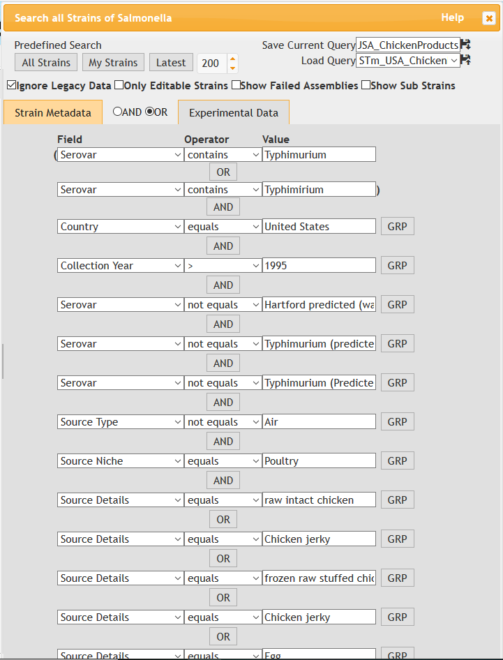
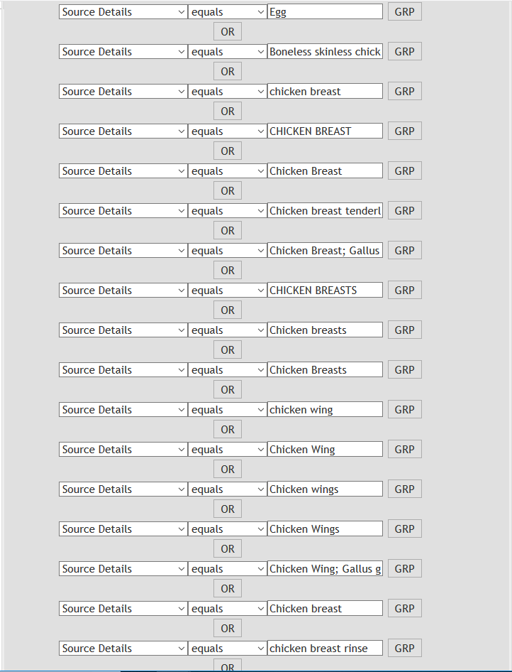
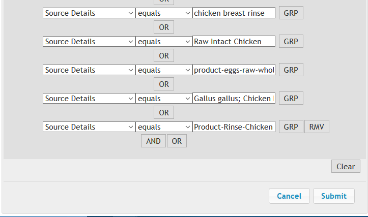

```{r load_libraries, message=FALSE, warning=FALSE}
library(tidyverse)
library(DT)
library(plotly)
```

# Introduction

## Topic

*Salmonella enterica* is a promiscuous pathogen, able to infect most vertbrates and a small number of invertebrates. The bacterium can be found worldwide, with many different strains that are are to infect different combination of hosts. Thus, it is important to build models for source prediction (i.e. where interms of host an outbreak originated from), and host prediction (what species can the strain of an outbreak infect). For that purpose, there have been many studies, my PhD included, which use machine learning to build such models.

Before such models are constructed though, there is a vital step often overlooked: *Data Collection*. Hunderds of thousands of Salmonella enterica sequences are available online. However, the metadata itself may be missing, or 'messy' with misspellings, capitalisations, abbreviations and other syntactic choices. Moreover, their quality and distribution across other metadata (geographic origin, host, year collected etc) can very greatly and may introduce unexpected bias that dooms the creation of a high quality model from the get-go (the 'garbage-in, garbage-out paradigm).

Therefore, I spent the beggining of my project aquiring and cleaning such data, though to a limited extent. The purpose of this presentation is to go over that process in greater detail, characterising and justifying my dataset as well as producing high-quality visualisations. 

***
***
***

# Methods

## Initial Restrictions

Because of the large diversity of *S. enterica* serovars (genetically distinct strains), we need to make sure that any genetic variation present is due to host, not of geospatial effects, or other causes of variation. Thus, I focused on the S. Typhimurium (STm) serovar. STm is widespread, and the number one cause of zoonotic (animal to human transmission) of Salmonella outbreaks. Though STm is considered a 'generalist' serovar (i.e. does not have a host preference), studies have identified host-specific clades. 

In summary, our dataset must have the following characteristics:

* Serovar must be Typhimurium

* Same country of origin

* Collected with 1995-2019

* Contain over 200 sequences for the following hosts:
  - Human
  - Bovine
  - Poultry
  - Swine

* Within hosts, sequences will be further subdivided to:
  - Animal (sequences derived from clinical data/fecal samples)
  - Products (sequences derived from raw meat and meat products)
  - Enviromental (sequences derived from the environment, such as feed)

***
***

## Acquiring Data

[Enterobase](http://enterobase.warwick.ac.uk/species/index/senterica) is a repository of publicly available *S. enterica* sequences.

At first glance, there are hunderds of thousands sequenecs available!


Country-wise, it seems the UK and the USA have the most sequences.However, when looking at host data...

 
 


With that in mind, I started constructing queries for each host, where it became obvious that the data was quite messy...
To demonstrate, below is one of the queries I used to capture the range





After a lot of trail-and-error quaries, I got the following number of sequences:

```{r enterobase_query_summary}
read_csv("./data/STm_All_Metadata.csv") %>% datatable()
read.csv("./data/STm_All_Metadata.csv") %>% ggplot( aes(x=Host, y=Count)) +
  geom_bar(stat="identity", fill="steelblue") +
  geom_text(aes(label=Count), vjust=1.6, size=3.5) +
  theme_bw() +
  facet_grid(~Country )
```

***
***

## Refinement

After obtaining my sequences, I calculated a few quality metrics for my sequences which were irrespective of the metadata. However, the latter was still a mess...

Below is my metadata from poultry-products (i.e. the sequences obtained from the example query above), as obtained from enterobase.

```{r}
messy_data <- read.delim("./data/STm_USA_ChickenProducts_Metadata.csv") 

summary(messy_data)
```

Capitalisation, mispellings, abbreviations... Have to clean all this up. Though I could QC based on metrics alone, I wanted to have a neater picture of my whole dataset.

So, I imported my datasets in openrefine (version 3.3). I won't go into boring detail about the data cleanig progress, but in broad strokes:
* combined metadata and sequence quality metrics
* cleaned up abbreviations, mispellings, cases etc... (took majority of my time)
  - also transformed/added a few columns based on data above (eg 2 letter code for states)
* filtered my dataset according to my quality metric cuttoffs

After cleaning the data, the end result is much neater:

```{r}
clean_data <- read.csv("./data/metadata_quast_all_merged_filtered_discarded.csv")

summary(clean_data)

```

***
***
***

# Analysis

**Goal**: what do I have in my dataset, and is it appropriate for my reserach? (What **is** appropriate for my reserach in the first place?)

**General Points of Interest**

**Host**: at least 100 sequences per host, and good spread across subcategories (especially in animal/products, environmental is interesting to examine but not vital)

**Organisation**: Due to different collection and analysis methods, the majority of my sequences should come from govermental agencies, such as the CDC for clinical samples or the FDA for food samples.

**State**: Geographically, how are my sequences spread out? Natural variations will occur due to districution of famrs and loivestock across the country, but I need to make sure that I dont have any extreme cases such as 90% of my swine product sequences coming from the same farm.

**Chronology**: When where my samples collected? I expect an increase in sequences collected from year to year, following advances in next-gen sequencing.


***
***

## Host


```{r, host_plots}

host_plot <- clean_data %>% count(Source.Host,Source.Context) %>%
  ggplot(aes(x=Source.Host,y=n,fill=Source.Context, label=n)) + 
  geom_bar(stat="identity") +
  labs(title="STm Sequences Collected in the United States by Host", y="Num. of Sequences", x="Host", fill="Host Context") +
  theme_bw() +
  geom_text(size = 3, position = position_stack(vjust = 0.5))

ggplotly(host_plot)


```

From the get-go we can see the following:

* Environmental samples make the minority of all samples within poultry and bovine, with none in human and swine.

* All of the human sequences are clinical

* The majority of sequences within bovine and swine are animal/clinical, whereas most in poultry are derived from meat products

Overall, I have passed my thershold for number of sequences across all hosts. Moreover, I have over 100 sequences in meat products alone across hosts (humans excluded for obvious reasons), that it may be possible to investigate if there is any selection of STm sequences when moving from animal to product.

***
***

## Organisation


### Host
```{r, org_plot_host, fig.width=10, fig.height=10}

org_host_plot <- clean_data %>% count(Lab.Contact.1, Source.Host) %>%
  ggplot(aes(x=Lab.Contact.1, y=n, fill=Source.Host)) + 
  geom_bar(stat ="identity") +
  labs(title="STm Sequences Collected in the United States",y="Num. of Sequences", x="Collection Agency/Laboratory", fill="Host")+
  theme_bw() +
  theme(axis.text.x = element_text(angle = 90, vjust = 0.5, hjust=1))

ggplotly(org_host_plot)

```

Roughly 2000 (~60%) sequences came from sub-branches within FDA, and 1050 (~32%) from the US Department of Argiculture (FSIS).

Most of the livestock sequences come from those two agencies, whereas the human sequences are scattered across agenceis, the CDC and Universities.

***

### Sub-Branches
```{r, org_plot_subbranch, fig.width=10, fig.height=10}

org_plot_subbranch <- clean_data %>% count(Lab.Contact.1, Lab.Contact.2) %>%
  ggplot(aes(x=Lab.Contact.1, y=n, fill=Lab.Contact.2)) + 
  geom_bar(stat ="identity") +
  labs(title="STm Sequences Collected in the United States", y= "Number of Sequences", x="Collection Agency/Laboratory",fill="Sub-Branch")+
  theme_bw() +
  theme(axis.text.x = element_text(angle = 90, vjust = 0.5, hjust=1))

ggplotly(org_plot_subbranch)

```

From the abbove we can see half the FDA sequences came from the Center for Food Safety and Applied Nutrition, whereas all the seuences from the USDA came from FSIS. 

The CDS sequences are also split, with the majority coming from the more general Enteric Diseases Laboratory Branch, and the rest from a specific sub-section of the aforementioned lab, [Pulsenet](https://www.cdc.gov/pulsenet/index.html), which aims to cluster diseases to detect outbreaks.

***

Overall, most of my livestock sequences come from two goverment agencies, as desired. Human sequences however are a more mixed bag.

Because of the overal low number of human sequences I have and how they are distributed, I will not be discarding any sequences at this stage. However, this will be something to keep in mind to investigate further down the road when refining my models.

***
***

## State


```{r}
# https://plotly.com/r/choropleth-maps/#using-builtin-country-and-state-geometries

#Get counts of sequences by state and host, then pivot from long to wide format (with respect to host), and put empty cells as 0), AND calculate sum of seqs across hosts
state_data <- clean_data %>% count(State_Code, Source.Host) %>% pivot_wider(names_from = Source.Host, values_from = n, values_fill=list(n=0)) %>% mutate(total_seqs = rowSums(.[2:5]))

state_data %>% datatable()

# set what text appears when hovering over in interactive geo map
state_data$hover<- with(state_data, paste(State_Code, '<br>',
                                          "Bovine Seqs: ", Bovine, '<br>',
                                          "Poultry Seqs: ", Poultry, '<br>',
                                          "Swine Seqs.: " , Swine, '<br>',
                                          "Human Seqs.: " , Human, '<br>'
                                          ))
# give state boundaries a white border
l <- list(color = toRGB("white"), width = 2)
# specify some map projection/options
g <- list(
  scope = 'usa',
  projection = list(type = 'albers usa'),
  showlakes = TRUE,
  lakecolor = toRGB('white')
)

#make plot
plot_geo(state_data, locationmode = 'USA-states') %>% 
  add_trace(
    z = ~total_seqs, text = ~hover, locations = ~State_Code,
    color = ~total_seqs, colors = 'Reds') %>% 
  colorbar(title = "STm Sequences") %>% 
  layout(
    title = 'STm Sequences collected Across USA States between 1998-2019',
    geo = g
  )

```

Overall, 189 of our sequences did not have state data.

As we can see Minnesota was the state with the highest number of sequences recorded, with 453 (~14%) of our sequences. As a first look, I believe things are ok distribution wise, but if I wanted to be more thorough, I would need to consult someone more familiar with US livestock or who is more familiar with Salmonella sampling methods (i.e. more research/ expert input may be needed).

***
***

## Chronology

```{r}

#bar chart with hosts coloured differently and difference of 1 year
#https://plotly.com/ggplot2/geom_bar/

# Count seqs per year and host and plot as bar chart
time_plot <- clean_data %>% count(Collection.Year, Source.Host) %>% 
  ggplot(aes(x=Collection.Year,y=n,fill=Source.Host)) + 
  geom_bar(stat ="identity") +
  labs(title="STm Sequences Collected in the United States", x="Collection Year", y="Sequences", fill="Host")+
  theme_bw() 

#make plot interactive
ggplotly(time_plot)
```

Generally, more Salmonella camples collected with each year, though when split up by hosts, some different patterns emerge:

* Poultry follows the general trendline with collected sequences increasing each year

* Swine sequence collection is overall the same, though with peaks and lows

* Most bovine sequences were collected in 2007, with more other collected sequences scattered throughout the years

* Human sequence collection is also sporadic, with most sequences clustered to certain years

The collection process is dependent on many factors, including outbreaks, monitoring guidelines and (to an extent) pure chance. It would be good to compare to historic outreak data, which may have resulted in more intense sample collection, as well as host/context-specific monitoring guidelines which may explain differences.

Overall though, sequences across hosts are spread across years, and despite diferent patterns, I do not believe that will be a cause of concern for my dataset.


***
***

# Conclusion

Overall, my expectaions were met, and though there may ares to examine further in the future while refining my models, I can currently say that my dataset will be adequate.
